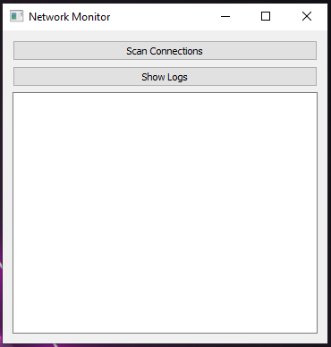

# 🕵️‍♂️ Network Monitor (Python + Microservices)

Network Monitor is a simple Python application that monitors network connections and shows:

* Open programs + IP + port.
* IP location (country/city).
* Real-time network usage.
* Logs saved for later review.

**Features:**

* Microservices Architecture (each service is independent).
* GUI with PyQt5.
* GeoIP Lookup using MaxMind.
* SQLite for logs storage.

**Installation:**

```bash
git clone https://github.com/SAliHashem/network-monitor.git
cd network-monitor
pip install -r requirements.txt
```

**Run:**

```bash
python run.py
```

**Screenshots:**




**Technologies used:**

* Python 3.x
* psutil
* geoip2
* FastAPI
* PyQt5

**Contributing:**

* Fork the project.
* Make your changes.
* Open a Pull Request.

---


برنامج Network Monitor بسيط مكتوب بالبايثون، يراقب اتصالات الشبكة ويعرض:

* البرامج المفتوحة + الـ IP + البورت.
* موقع الـ IP (الدولة/المدينة).
* استهلاك الشبكة بالوقت الفعلي.
* Logs محفوظة للاسترجاع لاحقًا.

**المميزات:**

* Microservices Architecture (كل خدمة مستقلة).
* واجهة GUI سهلة باستخدام PyQt5.
* GeoIP Lookup باستخدام MaxMind.
* تخزين السجلات في SQLite.

**التثبيت:**

```bash
git clone https://github.com/SAliHashem/network-monitor.git
cd network-monitor
pip install -r requirements.txt
```

**التشغيل:**

```bash
python run.py
```

**صور البرنامج:**


**التقنيات المستخدمة:**

* Python 3.x
* psutil
* geoip2
* FastAPI
* PyQt5

**المساهمة:**

* Fork المشروع.
* اعمل تغييراتك.
* افتح Pull Request.
